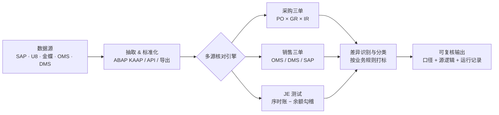

# 👋 Hi, I'm James Li

**IT Audit · Data Analytics · ERP Data Matching**

专注于四大IT审计需求的自动化工具构建的机车佬：从 SAP ECC & S4 Hana/ 用友U8 / OMS / DMS / 金蝶 等多源系统提取数据，构建采购、销售三单匹配、业财核对、经营数据分析、JETesting 等对账流程，输出可复核、可追溯的差异分析结果。

*A motorcycle rider building automation tools for Big-4 IT audit: extracting data from SAP ECC & S/4HANA, Yonyou U8, OMS / DMS, Kingdee and more, and building reconciliation pipelines for purchase & sales three-way matching, business-finance reconciliation, operating-data analysis and JE testing — delivering reviewable, traceable variance analysis.*

 

 

---

## 🧑‍💻 关于我 · About

- 四大IT审计背景（DTT*2year、KPMG*2year），现专注审计数据分析与自动化工具建设
  *Big-4 IT audit background (2 yrs DTT, 2 yrs KPMG), now focused on audit data analytics and automation tooling.*
- 把审计逻辑沉淀为可复用的数据工具，覆盖采购 / 销售三单匹配、SAP 取数、多源对账
  *Turning audit logic into reusable data tools — purchase / sales three-way matching, SAP data extraction, multi-source reconciliation.*

## 📂 项目矩阵 · Projects

⚠️ 数据合规声明 / Data Compliance Disclaimer

本主页仅用于技术交流，分享**无收益分成（no-revenue-sharing）**的通用代码处理逻辑。所有公开内容已依据下列法律法规进行脱敏处理：

- **《中华人民共和国个人信息保护法》第五十一条、第七十三条** — 对涉及的个人信息采取 **去标识化（de-identification）** 处理（删除直接标识符，使信息在不借助额外信息时无法识别特定自然人），并尽量达到 **匿名化** 标准；
- **《中华人民共和国数据安全法》第二十一条、第二十七条** — 对数据实行 **分类分级保护**，并针对公开内容采取相应的技术保护措施，保障数据安全；
- **《中华人民共和国反不正当竞争法》第九条** — 对原项目中的 **商业秘密**（客户名称、法律实体、内部标识、经营数据等）予以剔除与脱敏，避免不当披露。

**脱敏范围**：客户名称、法律实体、内部标识/代号、真实地址、支付与账户信息、订单/商品编码、财务数据及任何客户底稿（xlsx / sql / zip 等）。**任何财务数据与客户工作底稿均不在本主页及其仓库中存储或上传。**

All content shared here is for technical exchange only, on a no-revenue-sharing basis, and has been desensitized in accordance with the PIPL (de-identification / anonymization), the Data Security Law (classification, graded protection & technical safeguards), and the Anti-Unfair-Competition Law (trade-secret protection). No financial data or client working papers are stored or uploaded.

> 29 个公开仓库，按能力域分组；**★ 为核心可复用工具**（建议先看），「类型」标注其适用边界（通用底座 / 具体客户项目）。
> *29 public repos grouped by capability; ★ marks core reusable tools (start here). The 类型 column marks the scope: generic foundation vs. client-specific project.*

### ⭐ 核心仓库

| 仓库 | 说明 | 类型 | 技术 |
|---|---|---|---|
| ★ [sap-abap-data-extraction](https://github.com/Gvmeakiss/sap-abap-data-extraction) | SAP ABAP 取数 KAAP 配置与操作手册（FI / MM / SD），分模块取数范围与审计场景映射（三单匹配 / 序时账-余额核对） | 通用 | `ABAP` · `XML` · `PDF` |
| [kpmg-da-skills](https://github.com/Gvmeakiss/kpmg-da-skills) | 7 个可移植 Codex 审计数据分析技能（含 workbench 路由） | 通用 | `Skills` · `Codex` |
| [purchase-three-match-configurable](https://github.com/Gvmeakiss/purchase-three-match-configurable) | 可配置通用数据匹配工具包（SQL 解析 / 缓存 / 匹配键 / 分类驱动） | 通用 | `Python` · `Pandas` |
| [sales-oms-dms-match](https://github.com/Gvmeakiss/sales-oms-dms-match) | Miaoke ToB 销售 OMS / DMS 双源三单匹配（5 类差异） | Miaoke | `Python` |
| [u8-inventory-valuation](https://github.com/Gvmeakiss/u8-inventory-valuation) | U8 存货发出计价审计复核（CAATS / ITA 职责分离双工作簿） | 通用 | `Excel` · `U8` |
| [miaoke-sales-to-c](https://github.com/Gvmeakiss/miaoke-sales-to-c) | Miaoke ToC 四段 pairwise 对账（某电商平台 → 某订单中台 → OMS → SAP） | Miaoke | `Python` · `Pandas` |

### 📥 SAP ABAP 取数工具（FI / MM / SD）

> sap-abap-data-extraction 是执行三单匹配与序时账核对的基础。按 FI / MM / SD 三个模块配置 KAAP 取数脚本，分别支撑财务核算、采购与销售三单匹配。

| 仓库 | 说明 | 类型 | 技术 |
|---|---|---|---|
| [📒 FI — 财务取数](https://github.com/Gvmeakiss/sap-abap-data-extraction/blob/main/FI/README.md) | 抽序时账（BKPF + BSEG）与余额表（FAGLFLEXT / GLT0）、次要索引、科目主数据，支撑序时账-课余表勾稽（含 SAP 标准表参考） | 通用 | `ABAP` · `XML` |
| [📦 MM — 采购取数](https://github.com/Gvmeakiss/sap-abap-data-extraction/blob/main/MM/README.md) | 抽订单 / 采购历史（EKBE 枢纽）/ 收货 / 发票，支撑采购三单匹配（含 SAP 标准表参考） | 通用 | `ABAP` · `XML` |
| [🚚 SD — 销售取数](https://github.com/Gvmeakiss/sap-abap-data-extraction/blob/main/SD/README.md) | 抽订单 / 交货 / 开票 / 凭证流（VBFA），支撑销售三单匹配（含 SAP 标准表参考） | 通用 | `ABAP` · `XML` |

### 🛒 三单匹配 · 采购

> 通用三单匹配逻辑：采购订单（PO）× 收货（GR）× 发票（IR）三方核对，按 `(EBELN, EBELP)` 关联，输出**四大类十三子类**差异分析与可复核审计底稿。下列为核心可复用工具包；客户专属落地版见折叠。

| 仓库 | 说明 | 类型 | 技术 |
|---|---|---|---|
| ★ [purchase-three-match-configurable](https://github.com/Gvmeakiss/purchase-three-match-configurable) | 可配置通用数据匹配引擎（SQL 解析 / 缓存 / 匹配键 / 差异分类 / Excel 导出，配置驱动） | 通用 | `Python` · `Pandas` |
| [purchase-three-match-toolkit](https://github.com/Gvmeakiss/purchase-three-match-toolkit) | SAP MM 采购三单匹配（四大类十三子类差异分析，KPMG 格式 TXT） | 通用 | `Python` · `Pandas` |
| [purchase-three-match-final](https://github.com/Gvmeakiss/purchase-three-match-final) | 采购三单匹配整合版（四大类13子类，SAP ECC/S4） | 通用 | `Python` |

客户落地实现（NewHope / AQPP / Miaoke 专属，逻辑同核心工具包）

- [purchase-three-match-newhope](https://github.com/Gvmeakiss/purchase-three-match-newhope) — NewHope 采购三单匹配落地版（含 SAP 取数配套文档）
- [purchase-three-match-aqpp](https://github.com/Gvmeakiss/purchase-three-match-aqpp) — AQPP 2026 三单匹配归档索引（订单 / 发运 / 发票，AQPP-01~24）
- [miaoke-purchase-2026](https://github.com/Gvmeakiss/miaoke-purchase-2026) — Miaoke 2026H1 采购三单匹配（订单行粒度全外连接 + AQPP 24 组）

### 💰 三单匹配 · 销售

> 通用三单匹配逻辑：销售订单 × 交货单 × 发票三方核对，覆盖 SAP SD（`(VKORG, VBELN, POSNR)` / `AUBEL,AUPOS`）与 OMS / DMS 双源，输出 **13 场景 / 5 类差异**。下列为核心可复用工具包；客户专属落地版见折叠。

| 仓库 | 说明 | 类型 | 技术 |
|---|---|---|---|
| ★ [sap-sd-three-match](https://github.com/Gvmeakiss/sap-sd-three-match) | SAP SD 销售三单匹配（13 场景，按公司批量并行，关联键回退 + 借贷正负） | 通用 | `Python` · `SAP` |
| [sales-three-match-toolkit](https://github.com/Gvmeakiss/sales-three-match-toolkit) | SAP SD 销售三单匹配（大表 30GB+ 优化 / 负开票冲账 / Untested 四表） | 通用 | `Python` · `Pandas` |
| ★ [sales-oms-dms-match](https://github.com/Gvmeakiss/sales-oms-dms-match) | OMS / DMS 双源销售三单匹配（5 类差异，多销售组织分组导出） | 通用 | `Python` |

客户落地实现（NewHope / Miaoke 专属，逻辑同核心工具包）

- [sales-three-match-newhope](https://github.com/Gvmeakiss/sales-three-match-newhope) — NewHope 销售三单匹配实施版（含使用示例与排错）
- [sales-three-match-newhope-2026](https://github.com/Gvmeakiss/sales-three-match-newhope-2026) — NewHope 2026 销售三单匹配（AQPP 无交货金额 24 子组）
- [sales-three-match-miaoke-2026](https://github.com/Gvmeakiss/sales-three-match-miaoke-2026) — Miaoke 2026H1 销售三单匹配（OMS / DMS 双渠道 AQPP-01~24）
- [miaoke-sales-to-b-2025](https://github.com/Gvmeakiss/miaoke-sales-to-b-2025) — Miaoke 2025 全年 ToB 销售三单匹配（FY25 五分类）
- [miaoke-sales-to-b-2026](https://github.com/Gvmeakiss/miaoke-sales-to-b-2026) — Miaoke 2026H1 ToB 销售三单匹配（冲销前置 / PBC 拆分 / 单测）
- [miaoke-sales-to-c](https://github.com/Gvmeakiss/miaoke-sales-to-c) — Miaoke ToC 四段 pairwise 对账（某电商平台 → 某订单中台 → OMS → SAP）

### 🧾 SAP JETesting 核对

| 仓库 | 说明 | 类型 | 技术 |
|---|---|---|---|
| [sap-fi-2026h1](https://github.com/Gvmeakiss/sap-fi-2026h1) | SAP FI 2026H1 序时账 JE 测试（Journal Entry Testing）：ACDOCA / BKPF / FAGLFLEXT 抽取、过账勾稽与异常凭证筛查 | 通用 | `Python` · `SAP` |
| [CRRC_DT](https://github.com/Gvmeakiss/CRRC_DT) | CRRC 多公司 JE 会计分录测试：序时账合并 + 期初/发生额/期末余额勾稽（基于 ACDOCA / BKPF / BSEG） | 通用 | `Python` · `SAP` |
| [CRRC_XC](https://github.com/Gvmeakiss/CRRC_XC) | CRRC 材料板块多公司 JE 测试：序时账合并 + 余额交叉验证（基于 BKPF / BSEG） | 通用 | `Python` · `SAP` |
| [je-high-risk-screening](https://github.com/Gvmeakiss/je-high-risk-screening) | SAP JE 高风险分类筛查（HRC1/HRC2/HRC3 通用规则，序时账异常凭证识别） | 通用 | `SQL` · `Python` |
| [sap-je-toolkit](https://github.com/Gvmeakiss/sap-je-toolkit) | SAP 多公司 JE 测试工具箱：序时账合并 + 期初/发生额/期末余额勾稽 + 交叉验证 | 通用 | `Python` · `SAP` |

### 🧰 工具 & CAATS

> 工具类仓库按「一个仓库 = 一组相关工具」组织；下表按子工具 / SQL 模板逐条拆分，并链接至具体文件，便于检索与复用。

#### ★ test-tools · SAP MM 三单匹配诊断与数据质量

| 子工具 | 说明 | 类型 | 技术 |
|---|---|---|---|
| [data_merge · 数据合并](https://github.com/Gvmeakiss/test-tools/blob/main/data_merge/merge_all_mm_data.py) | MM 多源数据自动合并（订单 / 收货 / 发票） | 通用 | `Python` |
| [data_quality · 列校验](https://github.com/Gvmeakiss/test-tools/blob/main/data_quality/check_columns.py) | 列结构一致性校验（缺失 / 错位 / 类型） | 通用 | `Python` |
| [data_quality · 质量检查](https://github.com/Gvmeakiss/test-tools/blob/main/data_quality/check_data_quality.py) | 空值 / 重复 / 范围等数据质量规则检查 | 通用 | `Python` |
| [diagnostics · 匹配诊断](https://github.com/Gvmeakiss/test-tools/blob/main/diagnostics/why_match_was_zero.py) | 三单匹配为零归因诊断（定位断点） | 通用 | `Python` |

#### 🔧 dtt-python-tools · 通用 Python 工具（已脱敏）

| 子工具 | 说明 | 类型 | 技术 |
|---|---|---|---|
| [Excel 合并（脚本）](https://github.com/Gvmeakiss/dtt-python-tools/blob/main/merge_excel_tool.py) | 多工作簿 / 工作表批量合并 | 通用 | `Python` |
| [Excel 合并（Notebook）](https://github.com/Gvmeakiss/dtt-python-tools/blob/main/excel_files_merger.ipynb) | 交互式 Excel 合并示例 | 通用 | `Jupyter` |
| [模拟数据生成](https://github.com/Gvmeakiss/dtt-python-tools/blob/main/random_data_generator.ipynb) | 生成脱敏模拟数据集，用于工具自测 | 通用 | `Jupyter` |
| [项目编码提取](https://github.com/Gvmeakiss/dtt-python-tools/blob/main/project_code_extractor.ipynb) | 从文本 / 文档提取结构化项目编码 | 通用 | `Jupyter` |
| [网页爬虫](https://github.com/Gvmeakiss/dtt-python-tools/blob/main/web_crawler.ipynb) | 通用网页数据采集模板 | 通用 | `Jupyter` |

#### 🔧 dtt-caats-sql · 通用 CAATS / 勾稽 SQL 模板（已脱敏）

| 模板 | 说明 | 类型 | 技术 |
|---|---|---|---|
| [销售订单匹配](https://github.com/Gvmeakiss/dtt-caats-sql/blob/main/HM/01_sales_order_match.sql) | 销售订单 ↔ 收入勾稽、退货冲红、外币折算 | 通用 | `SQL` |
| [物料追溯](https://github.com/Gvmeakiss/dtt-caats-sql/blob/main/HM/02_material_trace.sql) | BOM 产出 ↔ 组件消耗勾稽、重复值检测 | 通用 | `SQL` |
| [出库单分析](https://github.com/Gvmeakiss/dtt-caats-sql/blob/main/JSM/01_data_analysis.sql) | 交付 / 退货 / 刷单 / 渠道集中度分析 | 通用 | `SQL` |
| [佣金 CAATS](https://github.com/Gvmeakiss/dtt-caats-sql/blob/main/BHSZ/01_caats.sql) | 成交金额 × 佣金率 vs 账面重算 | 通用 | `SQL` |
| [利息预提 JAT](https://github.com/Gvmeakiss/dtt-caats-sql/blob/main/BHYH/01_jat_caats.sql) | 应付利息应计重算（JAT） | 通用 | `SQL` |
| [会员对账](https://github.com/Gvmeakiss/dtt-caats-sql/blob/main/CSDN/01_member_recon.sql) | 多支付渠道流水合并对账 | 通用 | `SQL` |
| [会员权责](https://github.com/Gvmeakiss/dtt-caats-sql/blob/main/CSDN/02_member_rights_logic.sql) | 会员递延收益按天摊销（Hive） | 通用 | `SQL` |

#### 🔧 dylan-tool · 通用期末余额交叉验证

| 工具 | 说明 | 类型 | 技术 |
|---|---|---|---|
| [余额交叉验证](https://github.com/Gvmeakiss/dylan-tool/blob/main/balance_cross_validator.py) | 期初 + 凭证净额 − 期末 = 0 的批量勾稽 | 通用 | `Python` |

#### 🔧 audit-data-utilities · 通用审计数据工具

| 工具 | 说明 | 类型 | 技术 |
|---|---|---|---|
| [凭证模拟生成](https://github.com/Gvmeakiss/audit-data-utilities/blob/main/journal_generator.py) | 生成脱敏模拟序时账（journal entries）用于自测 | 通用 | `Python` |
| [余额模拟生成](https://github.com/Gvmeakiss/audit-data-utilities/blob/main/balance_generator.py) | 生成脱敏模拟科目余额表 | 通用 | `Python` |
| [数据完整性校验](https://github.com/Gvmeakiss/audit-data-utilities/blob/main/data_integrity_validator.py) | 勾稽规则校验（期初+发生额−期末=0 等） | 通用 | `Python` |
| [Excel 合并](https://github.com/Gvmeakiss/audit-data-utilities/blob/main/utils/merge_excel.py) | 多工作簿批量合并 | 通用 | `Python` |
| [预处理](https://github.com/Gvmeakiss/audit-data-utilities/blob/main/utils/preprocess.py) | 通用数据清洗与标准化 | 通用 | `Python` |
| [SQL→表](https://github.com/Gvmeakiss/audit-data-utilities/blob/main/utils/sql_to_table.py) | SQL 查询结果转结构化表 | 通用 | `Python` |

#### 🔧 ecommerce-order-analytics · 电商订单数据分析

| 工具 | 说明 | 类型 | 技术 |
|---|---|---|---|
| [订单分析](https://github.com/Gvmeakiss/ecommerce-order-analytics/blob/main/order_analytics.py) | 某电商平台订单多维分析（GMV / 复购 / 客单价，已脱敏） | 通用 | `Python` · `Pandas` |

---

## 🧩 能力覆盖矩阵 · Capability Coverage

| 能力域 | 核心技法 | 仓库 | 关键匹配键 / 公式 |
|---|---|---|---|
| 📥 SAP ABAP 取数 | FI / MM / SD 标准底表抽取 | 1 | `BKPF`/`BSEG` · `EKPO` · `VBAK`/`VBFA` |
| 🛒 采购三单匹配 | PO × GR × IR 三向核对、四大类十三子类差异 | 3 核心 (+3 客户) | `(EBELN, EBELP)` |
| 💰 销售三单匹配 | OMS / DMS / SAP 多源核对、13 场景 / 5 类差异 | 3 核心 (+5 客户) | `(VKORG, VBELN, POSNR)` |
| 🧾 SAP JE Testing | 序时账 – 余额勾稽 / HRC 筛查 | 5 | 期初 + 发生额 − 期末 = 0 |
| 🧰 工具 & CAATS | 匹配 / 合并 / 校验 / 勾稽 SQL / 数据工具 | 6 仓库 · 24 工具 | — |
| 📚 方法论 & 技能 | 可移植审计技能包 / 计价复核 | 2 | — |

*Coverage across 6 domains & 29 repos; the 工具 & CAATS row is split into 24 individual tools / SQL templates (see the 🧰 工具 section). Exact match keys follow each ERP's standard document structures (see References).*

## 🔄 工作流 · Pipeline

## 🧠 核心方法论 · Methodology

- **三单匹配（Three-Way Matching）**：采购订单 / 收货单 / 发票 三方核对，定位差异并分类
  *Three-way matching: cross-check purchase order / goods receipt / invoice; locate and classify variances.*
- **多源数据对账**：OMS / DMS / SAP 系统间数据一致性校验
  *Multi-source reconciliation: consistency checks across OMS / DMS / SAP.*
- **可复核输出**：每个结论附带口径说明、源数据逻辑与运行记录，支撑审计留痕
  *Reviewable output: every result ships with its basis, source-data logic and run records for audit trail.*

---

## 📚 参考与官方文档 · References

> 项目逻辑（三单匹配 / 序时账-余额核对 / 多源对账）依赖各 ERP 系统的标准数据结构与接口规范，以下为各厂商官方说明文档，作为数据口径与字段映射的权威依据。
> *The reconciliation logic relies on each ERP's standard data structures and interfaces. Official vendor docs below serve as the authoritative basis for data scoping and field mapping.*

### 🟦 SAP（ECC / S/4HANA）
- [SAP Help Portal](https://help.sap.com/docs/) — SAP 官方帮助门户，覆盖 ECC / S/4HANA 全模块文档
- [SAP ERP (ECC) 文档](https://help.sap.com/docs/SAP_ERP) — MM / SD / FI 模块标准配置与底表结构
- [SAP S/4HANA 文档](https://help.sap.com/docs/SAP_S4HANA_ON_PREMISE) — S/4HANA 总账（ACDOCA）与凭证架构
- [ABAP 关键字文档 / 数据字典](https://help.sap.com/doc/abapdocu_latest_index_htm/latest/index.htm) — 标准底表（BKPF / BSEG / EKPO / VBAK …）字段与域定义

### 🟥 用友（U8）
- [用友开发者中心](https://developer.yonyou.com/) — U8 / U9 / NC 开放接口与开发文档
- [用友 U8 产品与文档](https://u8.yonyou.com/) — U8 存货 / 供应链 / 财务模块说明

### 🟩 金蝶（Kingdee）
- [金蝶开放平台](https://open.kingdee.com/) — 金蝶云·苍穹 / K/3 开放 API 与集成规范
- [金蝶开发者社区](https://dev.kingdee.com/) — 苍穹 PaaS 平台开发文档与数据模型
- [金蝶官网](https://www.kingdee.com/) — 产品与模块总览

---

*Disclaimer: Personal projects and personal views. Not affiliated with or endorsed by KPMG.* 
*本页内容为个人项目与个人观点，与 KPMG 无关。*

